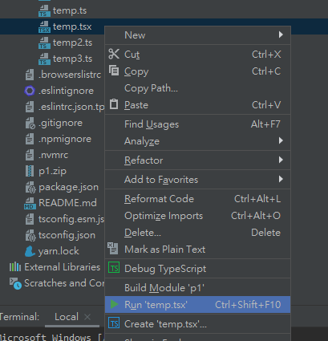
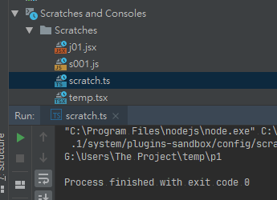
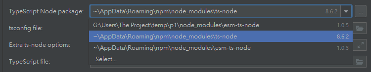
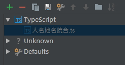
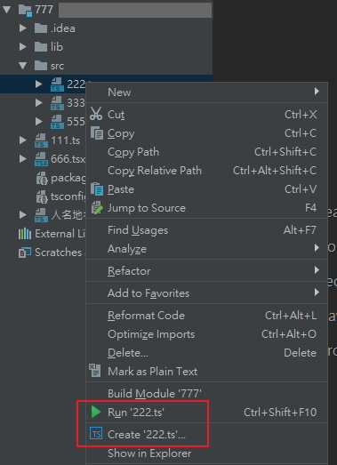
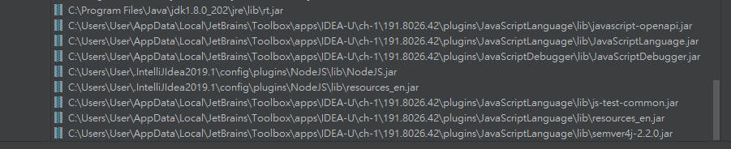

[](https://www.jetbrains.com/?from=novel-segment)

# Run Configuration for TypeScript

    IntelliJ IDEA (and WebStorm...) plugin to support 'TypeScript' as a run configuration

# requirements

- plugin: [NodeJS](https://plugins.jetbrains.com/plugin/6098-nodejs)

# install

1. via jetbrains [https://plugins.jetbrains.com/plugin/10841-run-configuration-for-typescript](https://plugins.jetbrains.com/plugin/10841-run-configuration-for-typescript)
2. github [idea-run-typescript.jar](releases/idea-run-typescript.jar) /  [idea-run-typescript.zip](releases/idea-run-typescript.zip)

# feature

- run .tsx? by ts-node like bin tool (e.g. ts-node , [esm-ts-node](https://www.npmjs.com/package/esm-ts-node))
- allow use env var `NODEJS_CONSOLE_USE_TERMINAL` for control Registry `nodejs.console.use.terminal` in Run Configuration bu this plugin
- support debug mode
- support set tsconfig
- support set argv for node, ts-node, current file
- support scratch file

[CHANGELOG.md](./CHANGELOG.md)

# screenshot

> support run/debug `.ts` , `.tsx`



> support scratch file



> support select `esm-ts-node`, `ts-node`



> other





# about this plugin

this is my first time touch kotlin/java

this plugin made by

1. copy / paste form many plugin
2. idea auto complete api
3. google lol

# dev

## IDEA 2019.1.4

```
IntelliJ IDEA 2019.1.4 (Ultimate Edition)
Build #IU-191.8026.42, built on July 30, 2019
JRE: 1.8.0_212-release-1586-b4 amd64
JVM: OpenJDK 64-Bit Server VM by JetBrains s.r.o
Windows 10 10.0
```



## link

- https://github.com/JetBrains/intellij-community
- https://zh.wikipedia.org/wiki/Kotlin
- https://www.kotlincn.net/
- https://github.com/t3hnar/CmdSupport
- https://github.com/jasmine/IdeaJasmine
- https://github.com/jansorg/BashSupport
- https://github.com/TypeStrong/ts-node
- https://github.com/xiyuan-fengyu/IdeaPluginTypeScriptExecutor
- https://github.com/nguyennk92/run-typescript-plugin
- https://plugins.jetbrains.com/docs/marketplace/intellij-plugin-recommendations.html
-

Icons made by [Freepik](https://www.freepik.com/) from [www.flaticon.com](https://www.flaticon.com/) is licensed by [CC 3.0 BY](http://creativecommons.org/licenses/by/3.0/)
